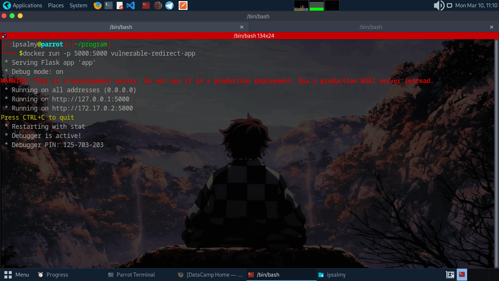

# Snoop Open Redirect Param Extension

Snoop Open Redirect Param Extension is a browser extension that scans webpages for potential open redirect parameters. It monitors URLs for common redirect parameters and detects potential security vulnerabilities.



## Features
- **Detects open redirect parameters** from visited webpages.
- **Logs detected redirect parameters** and allows users to review them.
- **Toggle ON/OFF** feature to control monitoring.
- **Clear logs** option for better organization.

## Installation

### Firefox
1. Open Firefox and navigate to `about:debugging` in the address bar.
2. Click on **This Firefox** in the left sidebar.
3. Click on **Load Temporary Add-on**.
4. Select the `manifest.json` file from the extension folder.
5. The extension should now be active.

### Chrome
1. Open Chrome and go to `chrome://extensions/`.
2. Enable **Developer mode** (toggle switch at the top right).
3. Click on **Load unpacked**.
4. Select the extension folder containing `manifest.json`.
5. The extension will now be loaded and active.

## Usage
1. **Enable the Extension**: Click on the extension icon and toggle the switch ON.
2. **View Detected Redirects**: The popup will display a list of detected redirect parameters.
3. **Clear Logs**: Click the **Clear** button to remove the detected logs.
4. **Disable the Extension**: Toggle the switch OFF to stop monitoring.

## Testing the Extension
You can use a local Flask server to test the extension with open redirect parameters or Clone and run the Docker locally

**Link:** 
```bash
  https://github.com/DghostNinja/vulnerable-redirect-app
```

### Example Test URL:
```
http://127.0.0.1:5000/redirect?url=http://evil.com
```
The extension should detect and display the redirect parameter (`url`).

## N.B
You can add more redirect parameters to the **contentscript.js {commonParams}** for more efficient detection.


### Folder Structure

```
/snoop-extension
│── manifest.json
│── background.js
│── popup.html
│── popup.js
│── icon.png
│── exet.gif
```

## Contributing
Feel free to submit issues or pull requests for improvements!

## License
MIT License
